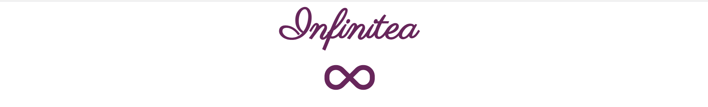
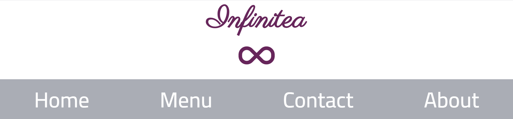
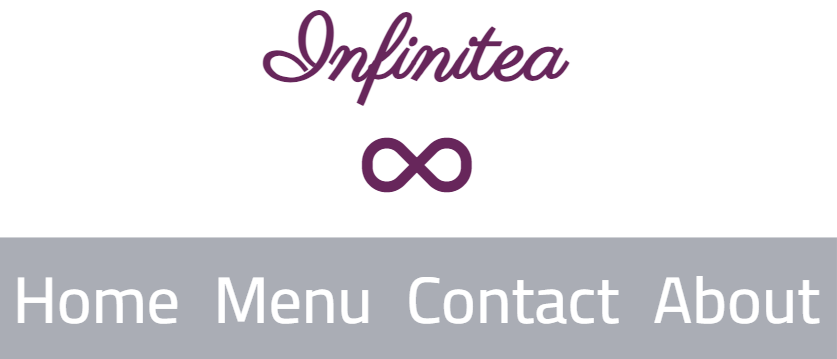
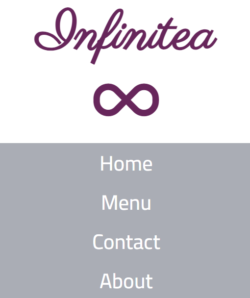
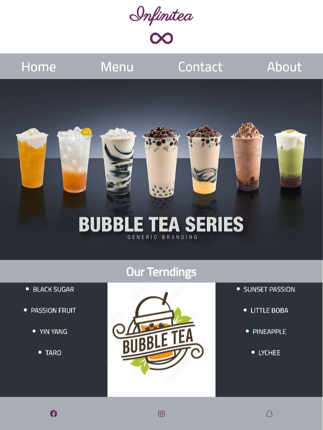
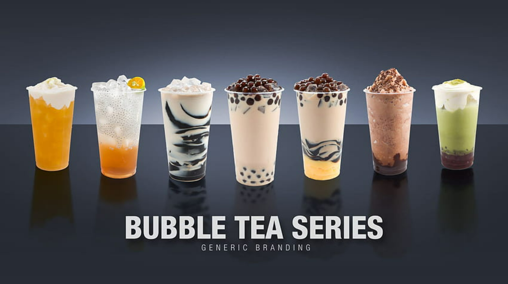
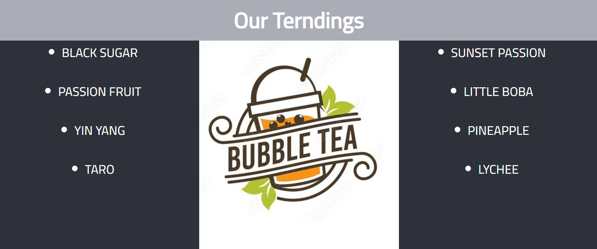

# *Infinitea*
Infinitea website allows people to browse wide range of products that the "Infinitea website" provide.
The site can be accessed by this [link](https://github.com/WaseemRabah/project1)

## User Stories

### First Time Visitor Goals:

* As a First Time Visitor, I want to easily understand the main purpose of the site.
* As a First Time Visitor, I want to be able to easily navigate through the website, so I can find the content.
* As a First Time Visitor, I want to see the testimonials, so I can see whether the website is trustworthy.

### Returning VisitorGoals:

* As a Returning Visitor, I want to see various tea products, so that I can pick from.
* As a Returning Visitor, I want to find a way to get in contact with the site administration, so that I can ask additional questions or send a request about a particular prodcuct.
* As a Returning Visitor, I want to find community links, so that I can learn more about the company.

### Frequent Visitor Goals:

* As a Frequent User, I want to check whether there are any changes with available products. 
* As a Frequent User, I want to have options for the reason to contact the company, so I can get an explicit answer to my email.

## Features

### Navbar

+ ##### Navigation

    - Positioned at the top of the page.
    - Contains logo of the company on the top of navigation bar.
    - Contains navigation links under the logo:
        * HOME - leads to the home page where users can learn about the top seller products.
        * MENU - leads to the menu page where users can see all products.
        * CONTACT - leads to the contact form page where users can fill out the form in order to get in touch with the company.
    - The links have animated hover effect.
    - The navigation is clear and easy to understand for the user.
    
    
    - The navigation bar is responsive:
        * On tablets:
        

        * On mobile devices: the navbar elemeents under eachother
        

---

+ ### Home Page

    - Represent: 

        * the main idea of the company.
        * Includes a main image of some products
        * Contains a section for best selling products.
        * Contains social media links.

        

---

+ #### Hero Section

    - Hero section have a wide image of our products.

    

+ #### Our trendings Section

    - Our trendings Section has 2 boxes of some products names and image between them.
    - Tells website visitors what is our best seller products.

    

---

+ #### Footer

    - Footer contains social media links that open in a new tab.

    
---

+ ### Menu Page

    - Menu page has navbar that Shows the user the types of tea And leads him to the chosen section.
    - It has a photos of the products.

        - The menu is responsive: the size of the photo depends on the user's screen.
        - Each image has a name that appear under each product.

    - It has a footer identical to the home page's footer.

---
+ ### Contact page

    - Contact page has a contact form:

        - All text input fields are customized.
        - All inputs are set to be required to fill out.
         The submit button is animated on hover.
